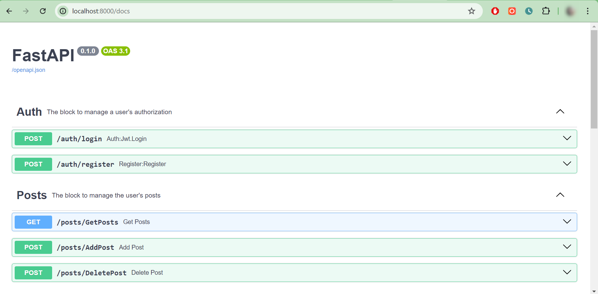

This project is a backend application built with FastAPI and MySQL. It provides endpoints for user registration, login, adding posts, retrieving posts, and deleting posts. The application follows the MVC design pattern and uses SQLAlchemy for database interactions. *It also uses **FastAPI Users (https://fastapi-users.github.io/fastapi-users/latest/)** for user management and employs asynchronous programming for improved performance.*



## API Endpoints

### 1. login endpoint
- **Description**: Allows users to sign up with their email and password.
- **Inputs**: `email`, `password`
- **Output**: Returns a token (JWT).

### 2. register endpoint
- **Description**: Authenticates users using their email and password.
- **Inputs**: `email`, `password`
- **Output**: Returns the user's data.

### 3. AddPost endpoint
- **Description**: Adds a new post.
- **Inputs**: `text`, `token`
- **Output**: Returns `postID`.
- **Details**: Validates the payload size (the payload should not exceed 1 MB in size) and saves the post in memory.

### 4. GetPosts endpoint
- **Description**: Retrieves all posts added by the authenticated user.
- **Inputs**: `token`
- **Output**: Returns all posts added by the user.
- **Details**: Implements response caching for consecutive requests from the same user for up to 5 minutes.

### 5. DeletePost endpoint
- **Description**: Deletes a specified post.
- **Inputs**: `postID`, `token` (to authenticate the request)
- **Output**: Confirms deletion of the corresponding post from memory.

---------------------------------------------------------------------------------------------------------------

## Moduls/programs used

- Python and FastAPI: Core of the application.
- MySQL: Database for storing user and post data.
- Alembic: For database migrations.
- Pydantic: For data validation.
- JWT: For authentication.
- FastAPI Users: For managing user registration, login, and authentication.
- Asynchronous Programming: To handle concurrent requests efficiently.

------------------------------------------------------------------------------------------------------------------

## Requirements 

- Python 3.9 or higher installed.
- MySQL server installed.

------------------------------------------------------------------------------------------------------------------

### Installation

Clone the repository:

```bash
git clone <repository_url>
cd fastapi_users_project
```

Create and activate a virtual environment:

```bash
python -m venv venv
source venv/bin/activate   # On Windows use `venv\Scripts\activate`
```

Install the required dependencies:

```bash
pip install -r requirements.txt
```

Create a .env file in the project root with the following content:

```bash
DB_USER = your_db_user
DB_PASS = your_db_password
DB_HOST = localhost
DB_NAME = fastapiproj
DB_PORT = 3306

MODE = PROD

SECRET = your_secret_key
JWT_LIFETIME_MINUTES = 30
```

Set up the database:

```bash
mysql -u root -p
CREATE DATABASE fastapiproj;
```

Use Alembic to create the tables:

```bash
alembic revision --autogenerate -m "Initial migration"
alembic upgrade head
```

Start the FastAPI application:

```bash
uvicorn src.main:app --host 0.0.0.0 --port 8000
```

Access the application at http://localhost:8000. You can view the automatically generated API documentation at http://localhost:8000/docs.

